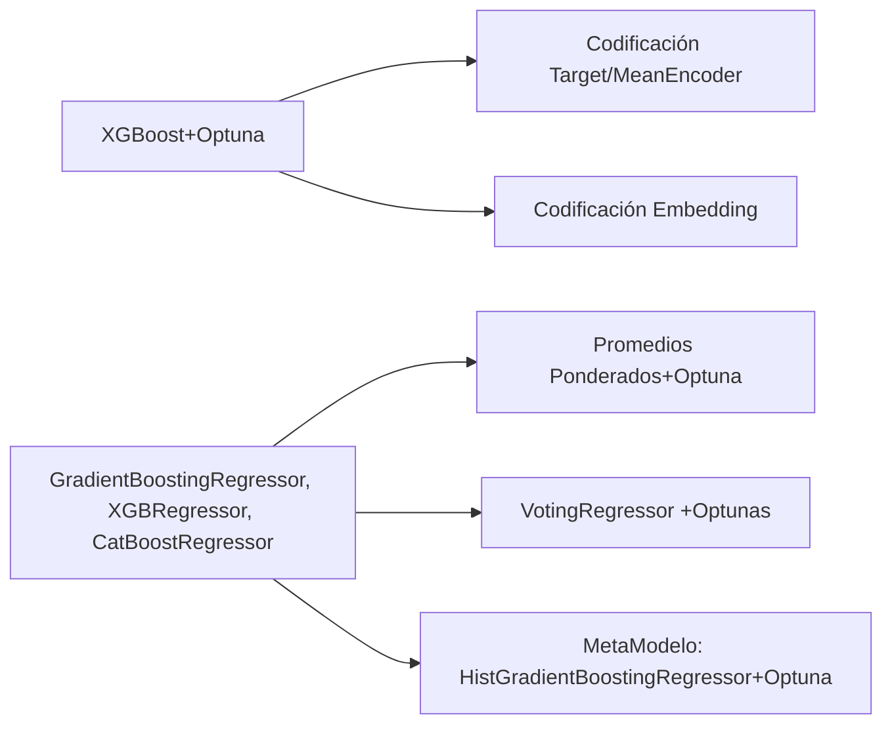

# Regression_Predict__sales

```mermaid
flowchart LR
    op[XGBoost+Optuna]
    op1[Codificación Target/MeanEncoder]
    op2[Codificación Embedding]

    op --> op1
    op --> op2

    op3[GradientBoostingRegressor, XGBRegressor, CatBoostRegressor]
    op4[Promedios Ponderados+Optuna]
    op5[VotingRegressor +Optunas]
    op6[MetaModelo: HistGradientBoostingRegressor+Optuna]

    op3 --> op4
    op3 --> op5
    op3 --> op6
```
