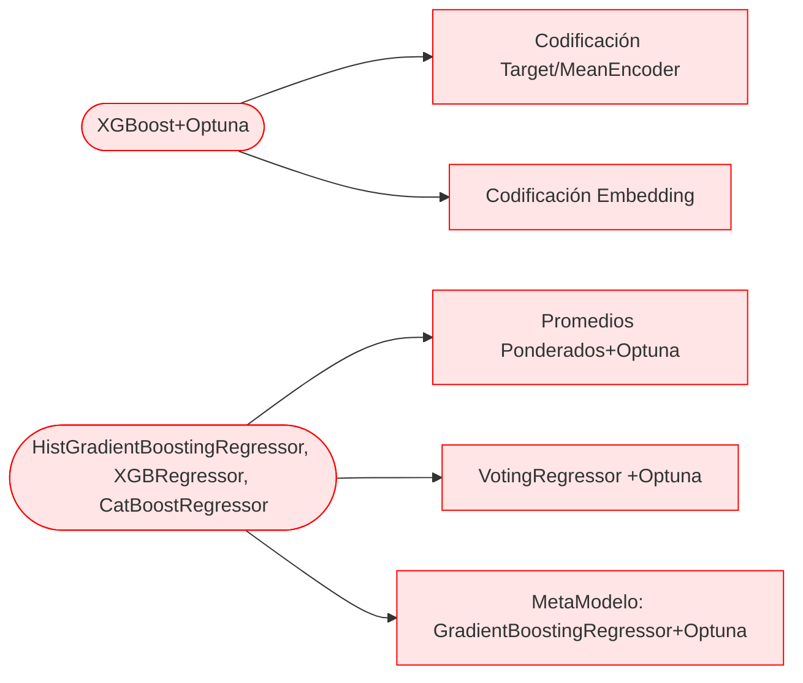
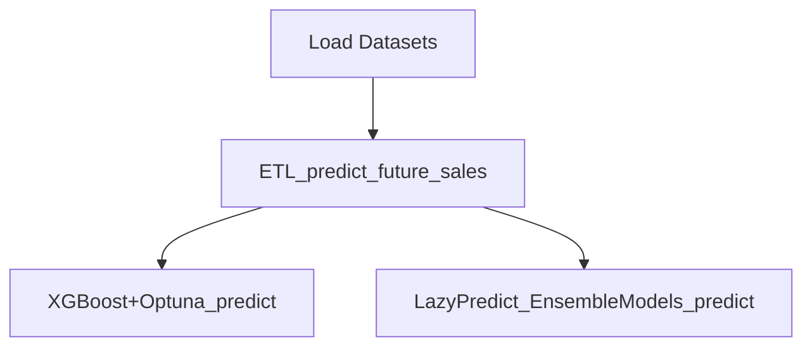

# Predicción de la demanda -  Modelos de Regresión 

## Descripción del proyecto
El conjunto de archivos proviene de un desafío llamado **Predict Future Sales**, una competencia que se encuentra en Kaggle.com: https://www.kaggle.com/competitions/competitive-data-science-predict-future-sales/data

Teniendo en cuenta las ventas históricas, se intenta predecir las ventas de un conjunto de tiendas y productos (shops - items).
Como parte de los requisitos de la competencia, el desempeño es determinado mediante  el error cuadrático medio (RMSE) y los valores objetivo verdaderos se recortan en el rango [0,20].

Se utilizan varias alternativas y recursos para desarrollar este proyecto con el fín de mejorar la práctica ampliar el conocimiento.

## Objetivo

Predecir las ventas del próximo mes utilizando diferentes modelos y recursos, buscando la mejor alternativa.

## Resultado

 - XGBoost con parámetros optimizados con Optuna.
  - Codificación Target/MeanEncoder 
   - Codificación Embedding
 - Modelos Ensamblados
 HistGradientBoostingRegressor + XGBRegressor + CatBoostRegressor
  - Promedios Ponderados, ponderaciones optimizadas con Optuna.
  - VotingRegressor con las ponderaciones optimizadas.
  - MetaModelo GradientBoostingRegressor , con las ponderaciones optimizadas.

 Utilizar las ponderaciones optimizadas en todos los ensambles dan mejores resultados.

*El modelo de Promedios Ponderados obtuvo el mejor de los rendimientos de todo los modelos, incluyendo XGBoost.*

También se utilizo LazyRegressor, pero con fines de práctica.

## Repositorio

**ETL_predict_future_sales.ipynb**: 
Transformación, Preprocesamiento y Análisis de los Datasets. El resultado final son dos Datasets llamados "train_cleaned" y "test_pred".

**XGBoost+Optuna_predict.ipynb**: 
Predicción de las ventas mensuales con XGBoost + Optuna. Utilizando codificaciones Target/MeanEncoder y Embedding en una variable categórica con el fín de apreciar cual se desempeña mejor. El resultado final es que la codificación Target/MeanEncoder es someramente mejor que Embedding.

**LazyPredict_EnsembleModels_predict.ipynb**: 
Predicción de las ventas mensuales con LazyRegressor.
Predicción de las ventas mensuales con 3 alternativas de modelos ensamblados. El resultado final son los ensambles de Promedios Ponderados, VotingRegressor y Metamodelo con GradientBoostingRegressor.

## FlowChart

## Conclusión

De todas las alternativas exploradas, el ensamble de Promedios Ponderados se desempeña mejor que el resto, se pueden seguir mejorando todos los modelos o proponer nuevos, como el dataset es de indole competitiva, en el siguiente link encontrará otras alternativas propuestas por los participantes:
https://www.kaggle.com/competitions/competitive-data-science-predict-future-sales/code
