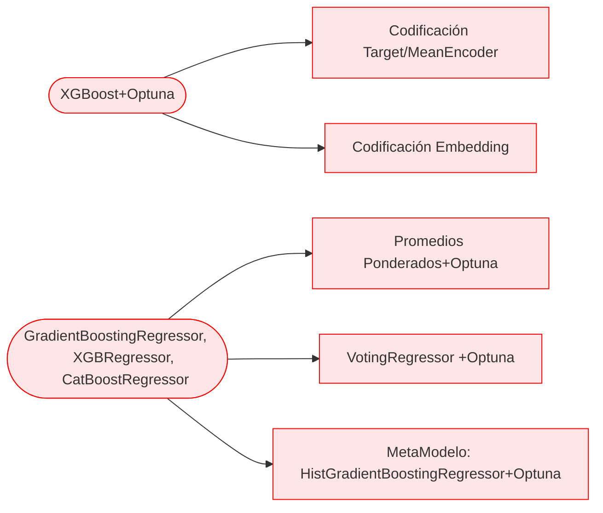

```mermaid
flowchart LR
    classDef foo stroke:#f00
    classDef foo fill:#ffe5e5

    classDef foi stroke:#ffcccc
    classDef foi fill:#ffe5e5

    st([XGBoost+Optuna])
    op1[Codificación Target/MeanEncoder]
    op2[Codificación Embedding]

    st:::foo --> op1:::foo & op2:::foo
 

    st3([GradientBoostingRegressor, 
    XGBRegressor, 
    CatBoostRegressor])
    op4[Promedios Ponderados+Optuna]
    op5[VotingRegressor +Optuna]
    op6[MetaModelo: HistGradientBoostingRegressor+Optuna]

    st3:::foo--> op4:::foo & op5:::foo & op6:::foo
```
