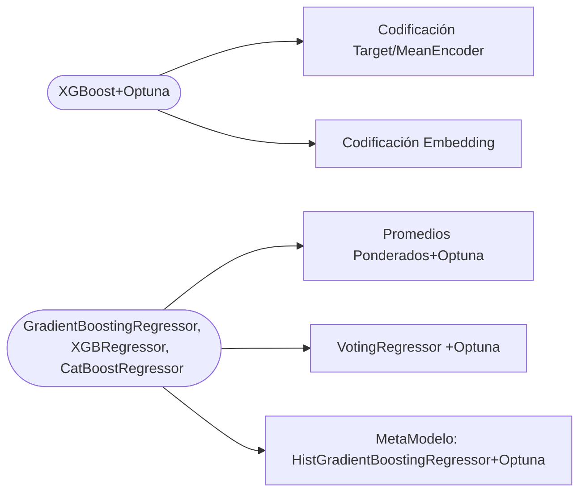

```mermaid
flowchart LR
    st([XGBoost+Optuna])
    op1[Codificación Target/MeanEncoder]
    op2[Codificación Embedding]

    st --> op1 & op2


    st3([GradientBoostingRegressor, 
    XGBRegressor, 
    CatBoostRegressor])
    op4[Promedios Ponderados+Optuna]
    op5[VotingRegressor +Optuna]
    op6[MetaModelo: HistGradientBoostingRegressor+Optuna]

    st3 --> op4 & op5 & op6
```
